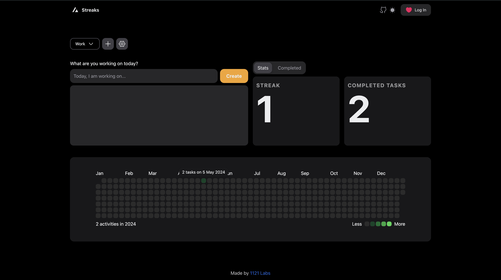

<div align="center">
  
</div>

# streaks

Visualize your consistency

## Technologies Used

- [Next.js 14](https://nextjs.org/docs/getting-started)
- [NextUI v2](https://nextui.org/)
- [Tailwind CSS](https://tailwindcss.com/)
- [Tailwind Variants](https://tailwind-variants.org)
- [TypeScript](https://www.typescriptlang.org/)
- [Framer Motion](https://www.framer.com/motion/)
- [next-themes](https://github.com/pacocoursey/next-themes)
- [Zustand](https://zustand-demo.pmnd.rs/)

## How to Use

### Install dependencies

```bash
pnpm i
```

### Run the development server

```bash
pnpm dev
```

### Setup pnpm (optional)

If you are using `pnpm`, you need to add the following code to your `.npmrc` file:

```bash
public-hoist-pattern[]=*@nextui-org/*
```

After modifying the `.npmrc` file, you need to run `pnpm install` again to ensure that the dependencies are installed correctly.

### .env

```bash
AUTH_SECRET=
AUTH_GITHUB_ID=
AUTH_GITHUB_SECRET=
DATABASE_URL="file:./data.db"
```

## Roadmap
### On Going

- [X] Trash icon - danger color
- [X] Use as guest
- [X] Persist data in local storage
- [X] Calculate streak
- [X] Edit task (inline)
- [X] Delete project (modal) (except 'All Projects')
    - [X] Cascade delete all associated tasks
- [X] Edit project name (modal) (except 'All Projects')
    - [X] Update project tag for tasks in 'Completed' tab
- [X] Populate edit field with current project name (workaround?)
- [X] Save current tab in URL search params
- [X] Open 'Completed' tab when a date is clicked on activity map
- [ ] Clean up
- [ ] Host it

### Up Next
- [ ] Delay in checking off task
- [ ] Mobile friendly design
- [ ] Sort based on project in completed tab
- [ ] Undo on today's completed tasks
- [ ] Focus on text input in new project modal
- [ ] Drag and drop tasks to reorder
- [ ] Emjoi picker in new project modal
- [ ] Year drop down in activity map
- [ ] Loading spinner after clicking Sign In button

### Later
- [ ] Use slices instead of two stores
- [ ] Settings page

## Dev Time 


## Resources
[Zustand best practices](https://tkdodo.eu/blog/working-with-zustand)